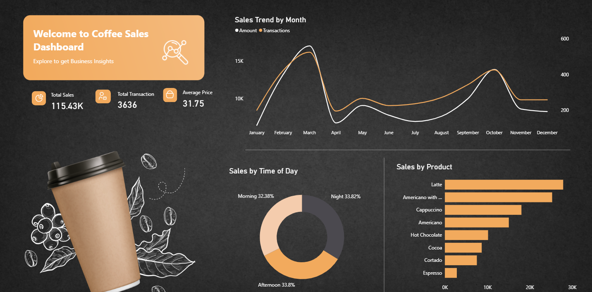
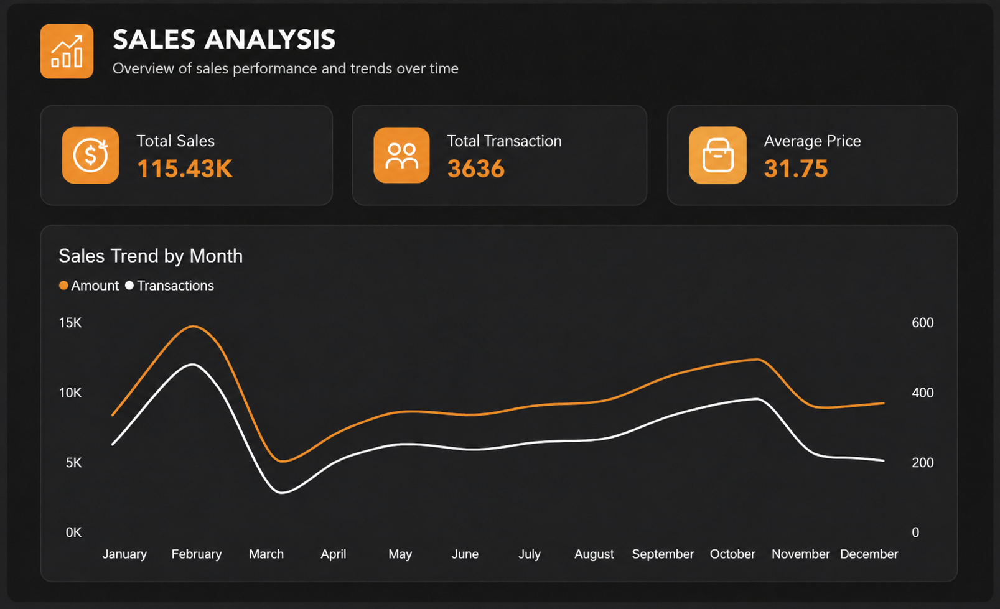
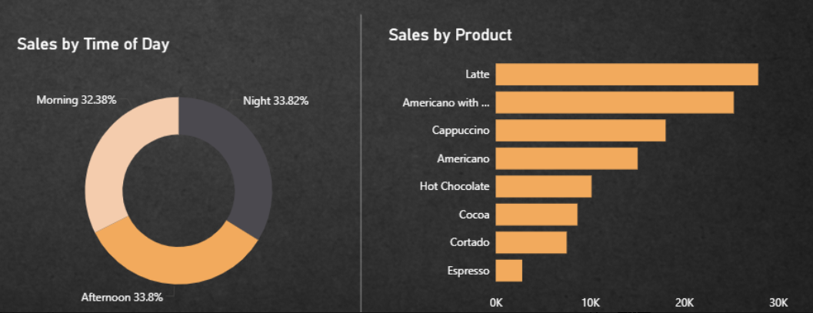

# ☕ Coffee Sales Dashboard | Power BI

## 📌 Overview
This project is a mini weekend exercise built using **Power BI** to analyze coffee shop sales data and derive meaningful business insights through interactive visualizations.

The dashboard provides insights into sales trends, customer purchasing behavior, product performance, and peak business hours.

---

## 🚀 Objectives
- Analyze overall sales performance.
- Identify top-selling coffee products.
- Understand customer purchasing patterns.
- Discover peak sales periods.
- Practice dashboard design and storytelling with data.

---

## 🛠️ Tools & Technologies Used
- Power BI
- Power Query
- DAX (Data Analysis Expressions)
- Data Cleaning & Transformation
- Data Visualization

---

## 📊 Dashboard Features
✔ KPI Cards for quick business insights  
✔ Sales Trend Analysis  
✔ Product-wise Performance Analysis  
✔ Interactive Slicers and Filters  
✔ Dynamic Visualizations  

---

## 📸 Dashboard Preview

### Dashboard Overview


### Sales Analysis


### Product Insights


---

## 📈 Key Insights
- Identified the most popular coffee products.
- Analyzed monthly sales trends and transaction patterns.
- Explored customer purchasing behavior based on time of day.
- Identified top-performing products contributing the highest revenue.
- Built an interactive dashboard for better business decision-making.

---

## 📂 Project Structure

```text
Coffee-Sales-Dashboard
│
├── Coffee Sales Dashboard.pbix
├── README.md
├── dashboardOverview.png
├── sales-analysis.png
└── product-insights.png
```

---

## 🎯 Learning Outcomes
This mini-project helped me strengthen my understanding of:

- Data Cleaning and Transformation
- Data Modeling in Power BI
- DAX Measures and Calculations
- Dashboard Design Principles
- Business Storytelling through Data
- Interactive Reporting and Visualization

---

## ⭐ About the Project
This dashboard was created as a **quick weekend project** to practice Power BI and improve data visualization skills by transforming raw data into actionable insights.

It was a fun exercise in combining analytics with dashboard design while learning how businesses can leverage data for decision-making.

If you found this project interesting, feel free to ⭐ the repository!

---

## 🔗 Connect With Me

### GitHub
https://github.com/DilSeDeveloper

### LinkedIn
https://www.linkedin.com/in/saumya-jain-3745b032a/

---

### 📌 Repository Topics
`powerbi` `data-analytics` `dashboard` `business-intelligence` `data-visualization` `dax`
